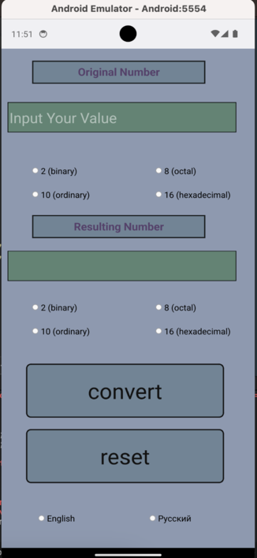

# Calculus System Converter

An easy-to-use application for transferring from one number system to another.The application is written in the Qt framework.

**The application supports the following systems:**
1. binary 
2. octal
3. ordinary
4. hexadecimal
5. BCD
6. Gray code

**Fixed-point numbers are supported**

**The application is supported on systems:**
1. **macOs**

  

2. **iOs**

  

3. **Windows**

  

4. **Android**

  
